# Catatan Perancangan Database SIAKAD

Dokumen ini merangkum struktur database yang dipakai aplikasi SIAKAD. Tujuannya supaya struktur data lebih mudah dijelaskan saat sidang dan lebih mudah dirawat ketika fitur bertambah.

## Prinsip Desain

1. `users` adalah tabel akun login dan otorisasi. Profil asli per peran disimpan di tabel turunan: `admin`, `guru`, `kepala_sekolah`, `siswa`, dan `pendaftaran`.
2. Data master akademik dipisah dari data transaksi. Contoh master: `kelas`, `mata_pelajaran`, `waktu_pelajaran`, `tahun_ajarans`. Contoh transaksi: `jadwal_pelajaran`, `nilai`, `absensi`, `absensi_guru`.
3. Data PPDB disimpan kompatibel di tabel `pendaftaran`, lalu dirapikan ke tabel detail per bagian formulir agar tidak terlalu melebar.
4. Foreign key dan unique index dipakai untuk menjaga integritas data, bukan hanya mengandalkan validasi frontend/backend.

## Kelompok Tabel

## Ringkasan ERD

```mermaid
erDiagram
    USERS ||--o| ADMIN : memiliki
    USERS ||--o| GURU : memiliki
    USERS ||--o| KEPALA_SEKOLAH : memiliki
    USERS ||--o| SISWA : memiliki
    USERS ||--o| PENDAFTARAN : mendaftar

    KELAS ||--o{ SISWA : berisi
    USERS ||--o{ KELAS : wali_kelas
    USERS ||--o{ MATA_PELAJARAN : guru_pengampu
    KELAS ||--o{ JADWAL_PELAJARAN : memiliki
    MATA_PELAJARAN ||--o{ JADWAL_PELAJARAN : dijadwalkan
    USERS ||--o{ JADWAL_PELAJARAN : mengajar
    WAKTU_PELAJARAN ||--o{ JADWAL_PELAJARAN : slot
    KELAS ||--o{ KELAS_MAPEL : membuka
    MATA_PELAJARAN ||--o{ KELAS_MAPEL : tersedia

    USERS ||--o{ NILAI : dinilai
    MATA_PELAJARAN ||--o{ NILAI : komponen
    USERS ||--o{ ABSENSI : absensi_siswa
    USERS ||--o{ ABSENSI_GURU : absensi_guru
    JADWAL_PELAJARAN ||--o{ ABSENSI : referensi

    PENDAFTARAN ||--o{ BERKAS_PENDAFTARANS : dokumen
    PENDAFTARAN ||--o| PENDAFTARAN_KETERANGAN_PRIBADI : detail
    PENDAFTARAN ||--o| PENDAFTARAN_KESEHATAN : detail
    PENDAFTARAN ||--o| PENDAFTARAN_PENDIDIKAN_ASAL : detail
    PENDAFTARAN ||--o| PENDAFTARAN_ORANG_TUA_WALI : detail
    PENDAFTARAN ||--o| PENDAFTARAN_KEPRIBADIAN : detail
    PENDAFTARAN ||--o| PENDAFTARAN_DOKUMEN : detail
```

### Akun dan Hak Akses

- `users`: akun login semua role.
- `roles`, `permissions`, `role_permission`, `menu_items`: RBAC dan menu berdasarkan permission.
- `admin`, `guru`, `kepala_sekolah`, `siswa`: profil per role, masing-masing terhubung 1:1 ke `users`.

Relasi penting:

- `users.id_user` 1:1 `admin.id_user`
- `users.id_user` 1:1 `guru.id_user`
- `users.id_user` 1:1 `kepala_sekolah.id_user`
- `users.id_user` 1:1 `siswa.id_user`

### Master Akademik

- `tahun_ajarans`: periode tahun ajaran dan semester.
- `kelas`: kelas, tingkat, jurusan, wali kelas, ruangan, kapasitas.
- `mata_pelajaran`: mata pelajaran dan guru pengampu.
- `waktu_pelajaran`: slot jam pelajaran.
- `kelas_mapel`: relasi many-to-many antara kelas dan mata pelajaran.

Aturan data penting:

- Satu profil guru/admin/kepala sekolah hanya boleh terhubung ke satu akun.
- Kombinasi `kelas.nama_kelas + tahun_ajaran` dibuat unik.
- Kombinasi `mata_pelajaran.nama_mapel + tingkat` dibuat unik.
- Kombinasi `kelas_mapel.id_kelas + id_mapel` dibuat unik agar mata pelajaran tidak dobel di kelas yang sama.

### Jadwal, Nilai, dan Absensi

- `jadwal_pelajaran`: jadwal mengajar berdasarkan kelas, mapel, guru, hari, jam, tahun ajaran, dan semester.
- `nilai`: nilai siswa per mapel, semester, dan tahun ajaran.
- `absensi`: absensi siswa per mapel/jadwal/tanggal.
- `absensi_guru`: absensi guru per tanggal.

Aturan data penting:

- Satu kelas tidak boleh memiliki dua jadwal pada slot hari/jam/periode yang sama.
- Satu guru tidak boleh mengajar dua jadwal pada slot hari/jam/periode yang sama.
- Satu siswa hanya punya satu data nilai untuk kombinasi siswa, mapel, semester, dan tahun ajaran yang sama.
- Satu guru hanya punya satu data absensi guru per tanggal.

### PPDB

Tabel utama:

- `pendaftaran`: identitas utama pendaftaran, status proses, nomor pendaftaran, dan kolom kompatibilitas untuk fitur lama.
- `berkas_pendaftarans`: dokumen yang diunggah calon murid.

Tabel detail yang dinormalisasi:

- `pendaftaran_keterangan_pribadi`
- `pendaftaran_kesehatan`
- `pendaftaran_pendidikan_asal`
- `pendaftaran_orang_tua_wali`
- `pendaftaran_kepribadian`
- `pendaftaran_dokumen`

Relasi:

- `users.id_user` 1:1 `pendaftaran.id_user`
- `pendaftaran.id_pendaftaran` 1:N `berkas_pendaftarans.pendaftaran_id`
- `pendaftaran.id_pendaftaran` 1:1 setiap tabel detail PPDB

Catatan implementasi:

- Controller PPDB tetap menyimpan kolom lama di `pendaftaran` supaya frontend yang sudah jadi tetap berjalan.
- Setiap step formulir juga disinkronkan ke tabel detail baru, sehingga struktur database lebih rapi dan siap dijelaskan sebagai desain ter-normalisasi.

## Catatan Untuk Penjelasan Sidang

Jika ditanya mengapa beberapa tabel akademik seperti `jadwal_pelajaran.id_guru` masih mengacu ke `users.id_user`, jawabannya:

> Pada aplikasi ini `users` berfungsi sebagai identitas akun aktif. Setiap guru memiliki profil detail di tabel `guru`, tetapi proses login, permission, dan filtering data memakai `id_user`. Karena itu relasi operasional seperti guru pengampu memakai `id_user`, lalu detail nama/NIP guru diambil melalui relasi `users -> guru`.

Jika ingin pengembangan berikutnya dibuat lebih murni secara akademik, kolom seperti `id_guru`, `id_guru_input`, dan `id_user_siswa` bisa dimigrasikan bertahap ke primary key tabel `guru.id_guru` dan `siswa.id_siswa`. Untuk versi saat ini, pendekatan `id_user` dipertahankan agar aplikasi tetap stabil dan tidak memutus kontrak API/frontend.
