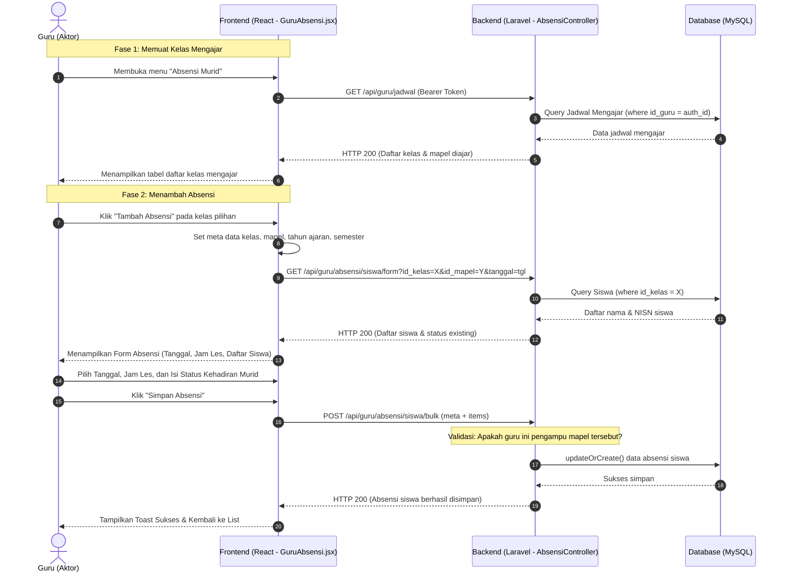

# Analisis & Revisi Use Case: Melakukan Absensi Murid (Aktor: Guru)

Dokumen ini disusun untuk membantu Anda melakukan revisi naskah skripsi (Bab 1–3) terkait bagian analisis sistem, khususnya pada Use Case **"Melakukan Absensi Murid"** oleh aktor **Guru**. Dokumen ini menyelaraskan naskah akademis skripsi dengan implementasi riil program yang telah diperbaiki.

---

## 1. Kritik Logika Akademis (Mengapa Use Case Lama Salah?)

Pada dokumen awal skripsi (Bab 1–3), Use Case "Mengelola/Mengisi Absensi" digambarkan di mana Guru memilih menu, lalu secara manual menginput **Tahun Ajaran**, **Semester**, **Bulan**, **Kelas**, dan **Mata Pelajaran** untuk membuat data absensi baru.

Secara logika akademik dan tata kelola sekolah, alur di atas memiliki **kelemahan fatal** yang pasti dikritik oleh dosen penguji:
1. **Redundansi & Inkonsistensi Data**: Guru tidak boleh dibebaskan memilih kelas atau mata pelajaran secara acak/manual. Jika Guru A mengajar Matematika di Kelas X-A, sistem tidak boleh membiarkan Guru A menginput absensi Bahasa Inggris di Kelas XII-B secara manual.
2. **Ketergantungan Jadwal (Schedule-Bound)**: Data Tahun Ajaran, Semester, Kelas, dan Mata Pelajaran yang diampu oleh seorang guru adalah **data transaksional terstruktur** yang sudah ditentukan oleh Administrator melalui jadwal pelajaran. Guru seharusnya hanya tinggal memilih jadwal mengajar aktifnya, bukan mengetik atau memilih drop-down parameter tersebut secara manual.
3. **Validitas Pertemuan**: Absensi dilakukan per **pertemuan nyata** (berdasarkan tanggal mengajar dan jam/les pelajaran), bukan per bulan secara kolektif langsung.

---

## 2. Solusi Logika Sistem & Program yang Diimplementasikan

Dalam program yang sudah berjalan, alur ini diselesaikan secara logis:
1. **Penyaringan Otomatis**: Saat Guru masuk ke menu Absensi, sistem memanggil API `/guru/jadwal` yang mencocokkan ID Guru yang sedang login. Sistem hanya menampilkan daftar kelas & mata pelajaran yang diajar oleh guru tersebut pada tahun ajaran dan semester aktif.
2. **Pilih Kelas Mengajar**: Guru memilih salah satu kelas/mapel dari daftar jadwal mengajarnya, lalu sistem mengarahkan ke form absensi yang secara otomatis mewarisi (inherit) data metadata kelas, mapel, tahun ajaran, dan semester tersebut.
3. **Pencatatan Pertemuan**: Guru hanya perlu menentukan **Tanggal** pertemuan dan **Jam Pelajaran (Les keberapa)**, mengisi kehadiran siswa (Hadir/Sakit/Izin/Alpa), lalu menyimpannya.
4. **Riwayat & Detail**: Guru dapat melihat riwayat absensi per tanggal pertemuan, melihat detailnya, serta memperbarui/menghapus riwayat tersebut.

---

## 3. Spesifikasi Use Case: Melakukan Absensi Murid (Revisi)

Berikut adalah tabel spesifikasi Use Case akademis yang dapat Anda salin langsung ke Bab 3 skripsi Anda:

| Aspek | Deskripsi |
| :--- | :--- |
| **Nama Use Case** | Melakukan Absensi Murid |
| **Aktor** | Guru |
| **Prakondisi** | 1. Guru sudah melakukan login ke sistem.<br>2. Administrator telah menginput jadwal pelajaran dan menugaskan kelas/mata pelajaran kepada Guru yang bersangkutan. |
| **Deskripsi** | Guru mencatat kehadiran murid berdasarkan kelas dan mata pelajaran yang diajarnya pada tanggal pertemuan tertentu. |
| **Alur Utama (Main Flow)** | 1. Guru memilih menu **Absensi Murid**.<br>2. Sistem menampilkan daftar kelas dan mata pelajaran yang diajar oleh Guru bersangkutan berdasarkan jadwal pelajaran aktif.<br>3. Guru memilih kelas dan mata pelajaran yang ingin diabsensi, lalu menekan tombol **Tambah Absensi**.<br>4. Sistem menampilkan form absensi yang berisi daftar murid di kelas tersebut, serta input Tanggal dan Jam Pelajaran (Les ke-).<br>5. Guru menentukan tanggal pertemuan dan memilih jam pelajaran (les ke-).<br>6. Guru mengisi status kehadiran setiap murid (Hadir, Sakit, Izin, Alpa) dan menambahkan keterangan jika diperlukan.<br>7. Guru menekan tombol **Simpan Absensi**.<br>8. Sistem memvalidasi data dan menyimpan catatan absensi ke dalam database. |
| **Alur Alternatif (Alternative Flow)** | **Skenario A: Mengubah Riwayat Absensi**<br>1. Guru memilih kelas dan mata pelajaran dari daftar mengajar, lalu menekan tombol **Riwayat Absensi**.<br>2. Sistem menampilkan daftar riwayat pertemuan absensi yang telah dicatat sebelumnya.<br>3. Guru memilih salah satu pertemuan dan mengklik tombol **Edit** (ikon pensil).<br>4. Sistem menampilkan data absensi pertemuan tersebut.<br>5. Guru memperbarui status kehadiran siswa, lalu mengklik **Simpan Absensi**.<br>6. Sistem memperbarui data absensi di database.<br><br>**Skenario B: Menghapus Riwayat Absensi**<br>1. Guru berada di halaman daftar riwayat absensi pertemuan.<br>2. Guru memilih salah satu pertemuan dan mengklik tombol **Hapus** (ikon tempat sampah).<br>3. Sistem menampilkan dialog konfirmasi penghapusan.<br>4. Guru mengonfirmasi penghapusan.<br>5. Sistem menghapus data absensi pertemuan tersebut dari database. |
| **Pascakondisi** | Data kehadiran murid untuk pertemuan mata pelajaran pada tanggal tersebut berhasil disimpan/diperbarui dan dapat dilihat oleh siswa maupun admin. |

---

## 4. Diagram Use Case (Mermaid)

Berikut visualisasi diagram Use Case yang sesuai dengan standar UML:

```mermaid
usecaseDiagram
    actor Guru
    
    rectangle "SIAKAD MAS Aisyiyah Medan" {
        usecase UC01 as "Melakukan Absensi Murid
        (Tambah Absensi)"
        usecase UC02 as "Melihat Riwayat &
        Detail Absensi"
        usecase UC03 as "Mengubah Catatan Absensi"
        usecase UC04 as "Menghapus Pertemuan Absensi"
    }
    
    Guru --> UC01
    Guru --> UC02
    Guru --> UC03
    Guru --> UC04
```

---

## 5. Sequence Diagram: Melakukan Absensi (Mermaid)

Diagram urutan (Sequence Diagram) di bawah ini menunjukkan aliran data riil dari antarmuka React (Frontend) ke Laravel API (Backend) hingga ke Database:


